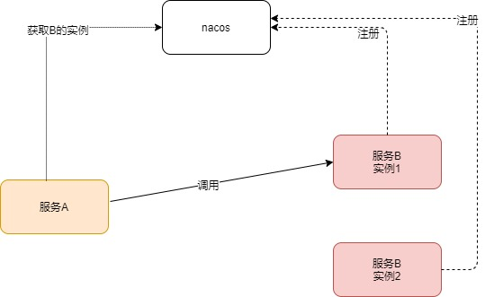

# 1. 介绍
使用spring-actuator 自定义endpoint 来下线nacos实例。

# 2. 背景
发布版本的时候存在如下情况导致调用失败



| 时刻  | 动作               |
|-----|------------------|
| T1  | 服务A从nacos获取服务B实例1 |
| T2  | 服务A负载均衡选择到实例1    |
| T3  | 服务B实例1下线         |
| T4  | 服务A调用服务B 实例1      |


## 解决方法
当前项目描述的方法1
### 1. 确保服务A拿到的实例一定是正常的
1. 服务B实例先从nacos下线。
2. 等待数秒后服务A知晓服务B实例下线。
3. 服务A调用服务B正常的实例。
### 2. 重试


# 3. 使用
## 本地安装jar
```shell
mvn install
```
## maven pom添加依赖
maven pom.xml
```xml
<dependency>
   <groupId>com.daxiyan.nacos</groupId>
   <artifactId>nacos-deregister-instance-actuator</artifactId>
   <version>1.0-SNAPSHOT</version>
</dependency>
```
## 引入冲突解决
排序依赖
```xml
     <dependency>
            <groupId>com.daxiyan.nacos</groupId>
            <artifactId>nacos-deregister-instance-actuator</artifactId>
            <version>1.0-SNAPSHOT</version>
            <exclusions>
                <exclusion>
                    <groupId>org.springframework.boot</groupId>
                    <artifactId>spring-boot-starter-actuator</artifactId>
                </exclusion>
                <exclusion>
                    <groupId>com.alibaba.cloud</groupId>
                    <artifactId>spring-cloud-starter-alibaba-nacos-discovery</artifactId>
                </exclusion>
            </exclusions>
        </dependency>
```
# 4.触发
bootstrap.yml 配置
```yml
#监控配置
management:
  endpoints:
    web:
      base-path: "/actuator"
      exposure:
        include: "*"
  endpoint:
    shutdown:
      enabled: true
  server:
    port: 9090
```

```shell
curl  http://localhost:{management.server.port}/actuator/nacos-deregister-instance
```
# 5. spring cloud 通用服务下线功能
搜索spring cloud应该提供这种通用的服务下线功能，后来的确看到了
org.springframework.cloud.client.serviceregistry.endpoint.ServiceRegistryEndpoint
```java
package org.springframework.cloud.client.serviceregistry.endpoint;
import org.springframework.boot.actuate.endpoint.annotation.Endpoint;
import org.springframework.boot.actuate.endpoint.annotation.ReadOperation;
import org.springframework.boot.actuate.endpoint.annotation.WriteOperation;
import org.springframework.cloud.client.serviceregistry.Registration;
import org.springframework.cloud.client.serviceregistry.ServiceRegistry;
import org.springframework.http.HttpStatus;
import org.springframework.http.ResponseEntity;
import org.springframework.util.Assert;
/**
 * Endpoint to display and set the service instance status using the ServiceRegistry.
 *
 * @author Spencer Gibb
 */
@SuppressWarnings("unchecked")
@Endpoint(id = "service-registry")
public class ServiceRegistryEndpoint {

    private final ServiceRegistry serviceRegistry;

    private Registration registration;

    public ServiceRegistryEndpoint(ServiceRegistry<?> serviceRegistry) {
        this.serviceRegistry = serviceRegistry;
    }

    public void setRegistration(Registration registration) {
        this.registration = registration;
    }

    @WriteOperation
    public ResponseEntity<?> setStatus(String status) {
        Assert.notNull(status, "status may not by null");

        if (this.registration == null) {
            return ResponseEntity.status(HttpStatus.NOT_FOUND)
                    .body("no registration found");
        }

        this.serviceRegistry.setStatus(this.registration, status);
        return ResponseEntity.ok().build();
    }

    @ReadOperation
    public ResponseEntity getStatus() {
        if (this.registration == null) {
            return ResponseEntity.status(HttpStatus.NOT_FOUND)
                    .body("no registration found");
        }

        return ResponseEntity.ok()
                .body(this.serviceRegistry.getStatus(this.registration));
    }
}
```

调用

```
curl -i -H "Content-Type: application/json" -X POST -d '{"status":"DOWN"}' http://localhost:9090/actuator/service-registry
```
